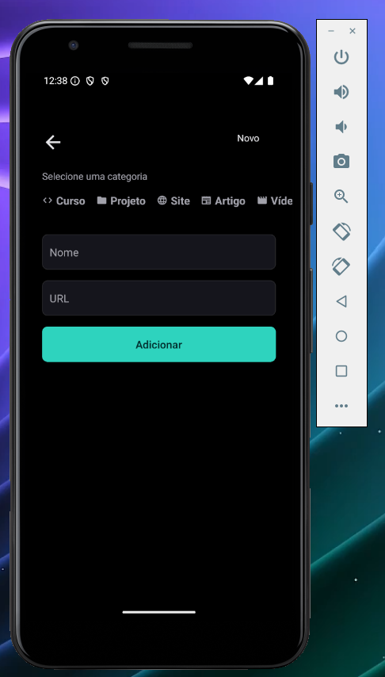
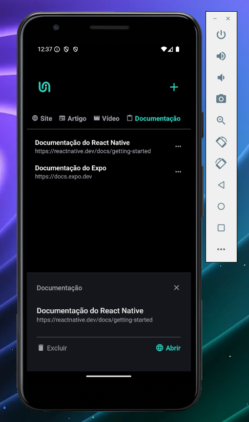

# Gerenciador de Links - React Native

Este é um aplicativo mobile desenvolvido em React Native que permite adicionar, organizar e persistir links no dispositivo. O projeto foi construído utilizando **Expo**, **TypeScript** e uma arquitetura moderna para garantir escalabilidade e facilidade de manutenção.


## 📱 Funcionalidades

- Adicionar novos links com título e URL.
- Organizar os links por categorias.
- Exibir uma lista de links.
- Abrir ou excluir links por meio de uma interface intuitiva.
- Persistência local dos dados para acesso offline.





---

## 🚀 Tecnologias Utilizadas

- [React Native](https://reactnative.dev/)
- [Expo](https://expo.dev/)
- [TypeScript](https://www.typescriptlang.org/)
- [Material Icons](https://mui.com/material-ui/material-icons/)
- [FlatList](https://reactnative.dev/docs/flatlist)
- Gerenciamento de estados com **useState** e navegação com **Expo Router**.

---

## 🛠️ Pré-requisitos

Para executar o projeto, é necessário ter instalado:

- [Node.js](https://nodejs.org/)
- [Expo CLI](https://expo.dev/)
- Um dispositivo Android ou iOS com o aplicativo **Expo Go** instalado ou um emulador configurado.

---

## 💻 Como Executar

1. Clone o repositório:
   ```bash
   git clone https://github.com/Futila/react-native-links-manager.git
   ```
2. Acesse a pasta do projeto::
   ```bash
   cd react-native-links-manager
   ```
3. Instale as dependências:
   ```bash
   npm install
   ```
4. Execute o projeto:
   ```bash
   npx expo start
   ```
5. Abra o aplicativo no Expo Go (dispositivo físico) ou no emulador.
